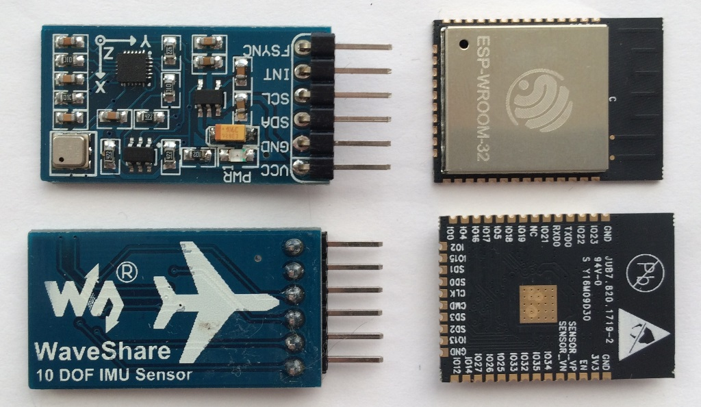
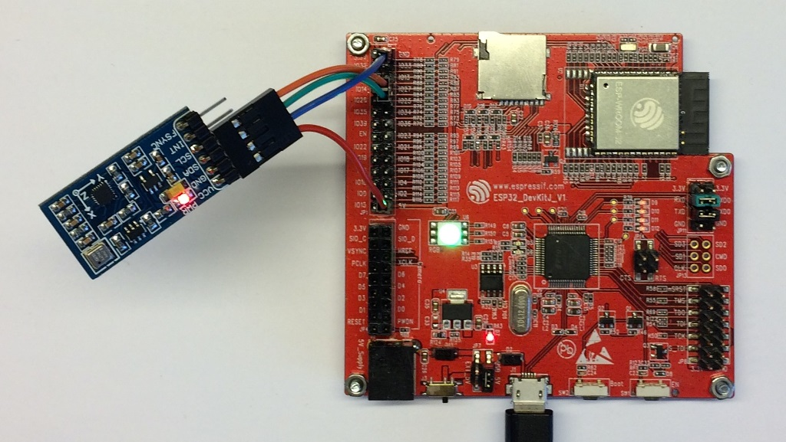
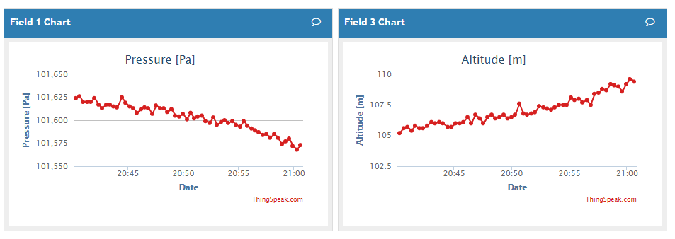
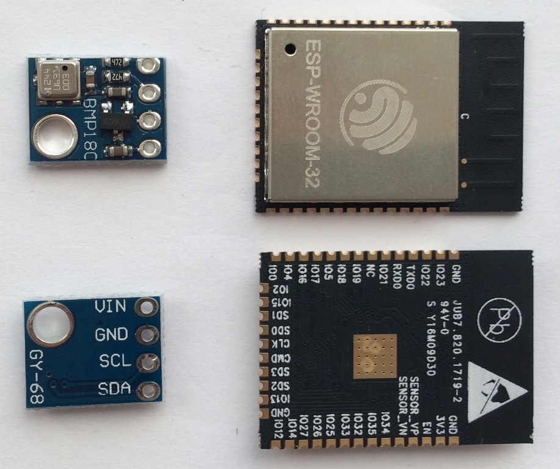
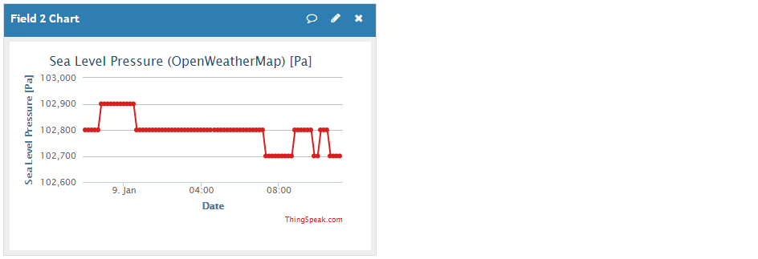
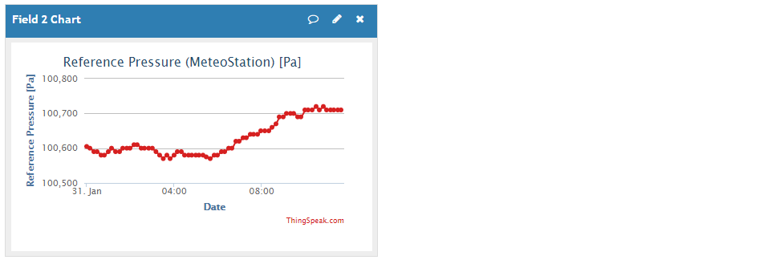
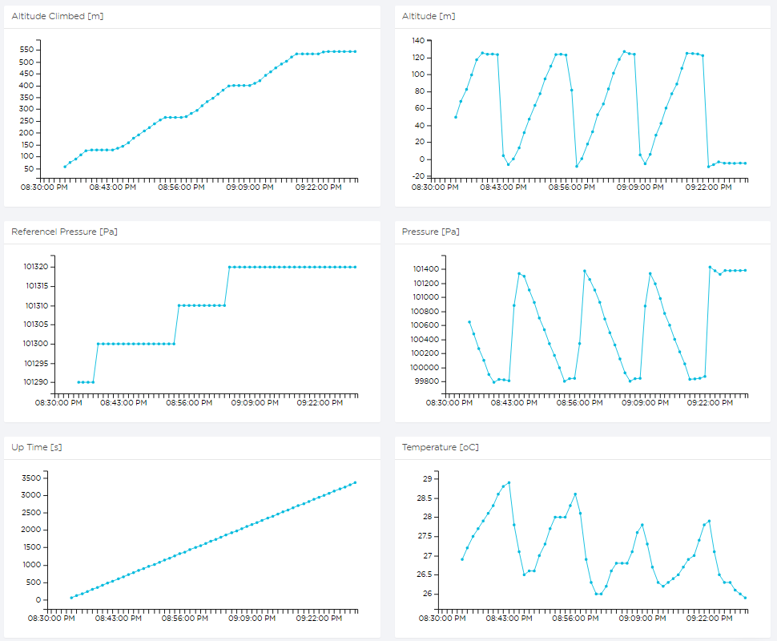

## Log Book

To reach the top of [Mount Everest](https://en.wikipedia.org/wiki/Mount_Everest), it usually takes years of preparation and thousands $ spent on equipment. [Everest Run](http://everestrun.pl/) makes it far more achievable and easier by letting you climb the highest peak of the Earth in the center of Warsaw! Well, far easier but still tough. To make it, you need to climb 2730 floors and it takes at [least 14 hours](http://everestrun.pl/wyniki-on-line-mer-2016/).

### About

#### December 18th, 2016

The number of people willing to participate in [Everest Run](http://everestrun.pl/) is always bigger then the limit of 200 places. I made it to the participant list only in second attempt. Some people did not pay the entrance fee and second draw was open. Now I am officially signed up for the [Everest Run](http://everestrun.pl/). My start slot is at 12:00 on February 18th, 2017.

### The Story

#### December 19th, 2016

I assessed my climbing time to be about 16 hours. This is a lot of time, beyond my imagination as for a continuous workout. Starting at 12:00 noon, I will be done next day by 4 in the morning! To be able to prove it later on to myself, that I did it, I decided to record progress throughout the race. This turned out to be a great opportunity to design, program and test in action a device to do such recording.

I enjoy development of projects with chips engineered by [Espressif](https://espressif.com/) like [ESP8266](https://espressif.com/en/products/hardware/esp8266ex/overview) and [ESP32](https://espressif.com/en/products/hardware/esp32/overview). They are powerful, cheap and widely used by [enthusiastic community](https://hackaday.com/tag/espressif/). For this project I have selected ESP32 - a nice tiny Wi-Fi + Bluetooth Combo Chip launched just couple of months ago, on September 1st, 2016. ESP will record climbing altitude with a digital pressure sensor and post results to the cloud for later review.

### First training

#### December 21st, 2016

To get familiar with challenge to face, I have joined group [Biegamy po schodach](https://www.facebook.com/groups/biegamyposchodach/) and started training. The first happened to be at the race place - Marriot hotel. I have climbed 42 floors 6 times, which made total of 252 floors completed within about 1 hour 30 minutes.

### First components are there

#### December 23rd, 2016

I found the core elements of altimeter under the Christmas tree. Good things come in pairs and here they are:
- [ESP-WROOM-32](https://espressif.com/sites/default/files/documentation/esp_wroom_32_datasheet_en.pdf) module
- 10 DOF IMU Sensor with [BMP180](https://www.bosch-sensortec.com/bst/products/all_products/bmp180) barometric pressure sensor on board



### First s/w release

#### December 28th, 2016

I have started with adopting existing s/w to read BMP180 sensor. Hardware I2C driver required for reading was not available yet in [esp-idf](https://github.com/espressif/esp-idf). Instead, I look for a bit bang s/w driver. I selected I2C library for ESP31B by Hristo Gochkov published within [esp32-cam-demo](https://github.com/igrr/esp32-cam-demo) by Ivan Grokhotkov. It worked great. I have added a simple function to scan I2C bus to discover addresses of BMP180 sensor and MPU9255 to be sure I have some response from 10 DOF IMU Sensor board. Then implemented the code to read individual BMP180 registers, calculate pressure and temperature out or raw values and finally calculate the altitude.

Then basing using example code provided in [examples folder](https://github.com/espressif/esp-idf/tree/master/examples) of esp-idf repository, I have added SNTP component to retrieve current time on-line from NTP server.

I have also published initial version HTTP request code. This one was also based on example taken from esp-idf repository.



All the testing has been done with [ESP-WROVER-KIT (DevKitJ)](https://espressif.com/sites/default/files/documentation/esp-wrover-kit_getting_started_guide_en.pdf). It that features several convenient connectors and features including JTAG interface, SD card slot, camera header, RGB LED, etc. as well as FT2232 USB to serial chip providing two USB channels and up to 3M Baud transfer speed.

### Second training

#### December 28th, 2016

Training took place in InterContinetal hotel. The place was nice with great view on Warsaw by night from the windows on the staircase. The climbing track was from level -5 to floor 43 completed 7 times. This makes 336 floors.

### Convert barometric pressure into altitude

#### January 1nd, 2017

Barometric pressure changes with altitude. It decreases as we climb up and increases, as we are going down. This relationship is described with specific [formula](https://en.wikipedia.org/wiki/Atmospheric_pressure#Altitude_variation) that we can transform and use to convert from pressure back to altitude.

Barometric pressure also changes with weather conditions. If we are not moving and the pressure changes, we would get changing altitude readings. We would not like false readings!

But the [formula](https://en.wikipedia.org/wiki/Atmospheric_pressure#Altitude_variation) already accounts for that. For calculations we also need to provide pressure measured as we were at the sea level.

How do we get the pressure at the sea level? By retrieving it form weather service specifically for our location. For this purpose I have selected https://openweathermap.org/.

By sending query like:
```
http://api.openweathermap.org/data/2.5/weather?q=London,uk&appid=12345678901234567890123456789012
```
We are getting back the following [JSON](https://en.wikipedia.org/wiki/JSON) string:
```
{"coord":{"lon":-0.13,"lat":51.51},"weather":[{"id":701,"main":"Mist","description":"mist","icon":"50d"},{"id":300,"main":"Drizzle","description":"light intensity drizzle","icon":"09d"},{"id":520,"main":"Rain","description":"light intensity shower rain","icon":"09d"}],"base":"stations","main":{"temp":282.48,"pressure":1031,"humidity":87,"temp_min":282.15,"temp_max":283.15},"visibility":10000,"wind":{"speed":2.1},"clouds":{"all":90},"dt":1483890600,"sys":{"type":1,"id":5091,"message":0.0072,"country":"GB","sunrise":1483862621,"sunset":1483891910},"id":2643743,"name":"London","cod":200}
```
Among provided values we can find `"pressure":1031` we are looking for.

Basing on HTTP request code from es-idf [examples folder](https://github.com/espressif/esp-idf/tree/master/examples) it was quite easy to implement data retrieval from https://openweathermap.org/.


### Posting with ESP32 to ThingSpeak

#### January 1st, 2017

HTTP request code turned out to be really useful as a standalone component. I has been reused to post data to [ThingSpeak](https://thingspeak.com/channels/208884).



Picture above shows pressure measurement (left), which is then converted into altitude (right). During these measurements the sensor has not been moved at all. Visible drift of altitude up (as the pressure goes down) indicates lack of compensation from pressure changes due to weather conditions. This issue will be addressed separately in next stages of this project.

### Separate BMP180 sensors

#### January 2nd, 2017

Initial selection of 10 DOF IMU Sensors was overkill. I do not need accelerometer, gyroscope and magnetometer. All I really need is the pressure sensor to covert barometric pressure into altitude. To make my design smaller and consuming less power I decided to order another break board with BMP180 sensor only. It just arrived. As ESP32 is operating on 3.3V I would like to standardize design on this particular voltage. To do so, I plan to bypass power regulator that is in place to power the BMP180 break out with 5V.



The BMP180 break boards are cheap, so I have ordered two of them. With 10 DOF IMU Sensor boards I have, one of them provided pressure measurements off by about 7%. It is always better to have some equipment redundancy for comparison and backup in case of h/w failure.

### Third training

#### January 3rd, 2017

Organizers rotate the training places and this one was [Palace of Culture and Science](https://en.wikipedia.org/wiki/Palace_of_Culture_and_Science). The track leads through three staircases with total of 26 floors. I climbed it 13 times making altogether 338 floors. Going downstairs during training and the race is always using elevator. There are six elevators available for us. Since the training is in the afternoon after working hours, we can go down with almost no waiting for elevator to come.

### Issue with resolution of pressure from OpenWeatherMap

#### January 9th, 2017

Altitude is calculated from barometric pressure measured by BMP180 as I will be climbing. To account for pressure changes due to changing water conditions, measurement is compensated using barometric pressure at the sea level. We are obtaining the sea level pressure on-line from https://openweathermap.org/. Resolution of this value is provided only in whole hPa, that is visible as steps on the chart below.



Pressure increase of 1 hPa (100 Pa) at my location is equivalent to climbing of about 10 m. If I calculate altitude from pressure measured by BMP180 and compensate it with the above measurement I am getting altitude jumps up or down by about 10 m, each time pressure at the sea level jumps by +/-1 hPa.

Chart below provides evidence of this issue with BMP180 sensor placed on my desk and not moved. On the left there is pressure measured by BMP180 that obviously changes due to weather conditions. The chart with altitude (right) should be flat as we compensate those changes with reference measurement obtained from OpenWeatherMap. Instead of a flat line we see jumps of altitude that correspond exactly to jumps of reference (sea level pressure) measurement.

 and altitude after compensation (right)")

To resolve this deficiency I have asked [OpenWeatherMap](https://openweathermap.org/) to provide pressure value with more significant digits. If they are unable to do so, I am planning to switch to another service that provides better resolution, like [MeteoStation](http://www.if.pw.edu.pl/~meteo/okienkow.php) by Faculty of Physics at Warsaw University of Technology. Another option is to set up own reference pressure measurement.

### Fourth training

#### January 11th, 2017

Climbed Marriot hotel nine times x 42 floors. That makes together 378 floors. Challenge for next training: make more than 400 floors.

### Wi-Fi signal Coverage

#### January 22nd, 2017

One of issues this project should consider is losing Wi-Fi signal coverage. I may not be able to continuously transmit altitude measurements to the cloud for visualization. Climbing will take place in an evacuation / emergency exit staircase and I will go down with an elevator. In such places signal of a Wi-Fi access point may be available only at some specific spots. Therefore, I need to consider buffering of data and then sending them out in a batch once Wi-Fi connection is available. 

How often should I measure and much data should I transmit? Climbing of 42 floors / 147 m takes about 10 minutes. The climbing pace is about 4s / m. (As a runner I prefer to describe how quickly I run in s ([pace](https://en.wikipedia.org/wiki/Pace_(speed)#Running)) / m than in m / s (speed). Using pace is even more appropriate for climbing that is much slower that running.) Typical unfiltered noise of altitude measurement I see with my sensor is about 0.5 m. If I apply filtering I should be able to fix this noise. On the other hand, I do not need instant visualization of altitude changes with less than a meter resolution. I think it should be sufficient to post measurement on average every 3 meters climbed. / once per about 12 seconds. This will produce about 50 measurements for one climbing round of 42 floors.

On the other hand, I am not concerned with visualization how quickly I go down with an elevator. The time to travel down is less than 1 minute and I will not consider it in calculations. 

Basing on the above rough estimates I will post data on average every 12 seconds. This is ruling out [ThinkSpeak](https://thingspeak.com/) that does not allow posting faster than once every 15 seconds. [Emoncms](https://emoncms.org/) should be fine as it allows posting every 10s.

But what about data buffering and posting all values in batches? The most compelling solution I found is provided by [Keen IO](https://keen.io/). They also provide easy method to attach time stamps to historical data that can be posted in a batch. 

Typical JSON to post historical data looks as follows:
```
{
    "everest-run" : [
        { "Altitude": 133.1,
          "keen": { "timestamp": "2017-01-21T10:05:34.005Z"}
        },
        { "Altitude": 136.5,
          "keen": { "timestamp": "2017-01-21T10:05:46.005Z"}
        },
        { "Altitude": 140.1,
          "keen": { "timestamp": "2017-01-21T10:05:59.005Z"}
        },
        { "Altitude": 142.9,
          "keen": { "timestamp": "2017-01-21T10:06:13.005Z"}
        }
    ]
}
```

For additinal details on posting data in JSON fromat check [Python Client for the Keen IO API](https://github.com/keenlabs/KeenClient-Python).  

Using free account, I can post 50,000 events per month. This is more than enough for the Everest Run (roughly about 3300 measurements). Also they do not limit how often I post the data. The only downside is that I cannot present dashboard with results on-line using [Keen IO](https://keen.io/) site. I would need to provide my own web site and query data from [Keen IO](https://keen.io/) server. I have checked with [Keen IO](https://keen.io/) and they consider option of public data visualization out of Keen IO site, but this functionality is not available yet.

Repository now features a new [component](components/keenio) to post data to [Keen IO](https://keen.io/) cloud.

### Fifth training

#### January 25th, 2017

I missed training in InterContinetal hotel last week and landed for the second time in a row in Marriot.  Climbed 42 floors x 11 times = 462 floors.  Now I have no excuse to make 500 floors during next training in Palace of Culture and Science.

### New Provider of Weather Data

#### January 30th, 2017

I got reply from [OpenWeatherMap](https://openweathermap.org/) that they are unable to improve resolution of atmospheric pressure measurement, because this the resolution they get from their provider. They are also not going to change the provider to one that offers better resolution.  

Basing on that I decided to implemented alternate an plan discussed [above](#issue-with-resolution-of-pressure-from-openweathermap). I will retrieve atmospheric pressure from [MeteoStation](http://www.if.pw.edu.pl/~meteo/okienkow.php) set up by Warsaw University of Technology. Comparing to [OpenWeatherMap](https://openweathermap.org/), the [MeteoStation](http://www.if.pw.edu.pl/~meteo/okienkow.php) provides atmospheric pressure in hPa with one extra significant digit after a decimal point. 

They do not provide weather data in JSON format like [OpenWeatherMap](https://openweathermap.org/), so I have to phrase what is displayed on their web page. Here is short code snippet searching for `hPa` string and extracting pressure value.

```c
    char* str_pos = strstr(response_body, "hPa");
    if (str_pos != NULL) {
        *str_pos = '\0';  // terminate string where found 'hPa'
        // identify beginning of pressure value in the string
        char* str_pressure = str_pos - 7;  // actual value is > 999.9 hPa
        if (str_pressure[0] < '0' || str_pressure[0] > '9') {
            str_pressure = str_pos - 6;  // actual value is < 1000.0 hPa
        }
        ESP_LOGI(TAG, "Atmospheric pressure (str): %s", str_pressure);
        // search for ',' and replace it with '.' as it is used alternatively as a decimal point
        str_pos = strchr(str_pressure, ',');
        if (str_pos != NULL) {
            *str_pos = '.';
        }
        weather.pressure = atof(str_pressure);  // convert string to float
        ESP_LOGI(TAG, "Atmospheric pressure (float): %0.1f", weather.pressure);
    } else {
        ESP_LOGE(TAG, "Could not find any atmospheric pressure value");
    }
```

[MeteoStation](http://www.if.pw.edu.pl/~meteo/okienkow.php) is altering displayed data between Polish and English language version that uses either comma or dot for the decimal point. To be able to convert the whole string to float, code replaces comma with dot if found in phrased text.

With improved resolution by one extra significant digit, the undesired fluctuations of compensated altitude measurements should be reduced by one order of magnitude. In the other words, for the altitude sensor placed in a fixed location, instead of about 10 m disturbance due to pressure compensation, I expect about 1 m disturbance. Below is sample measurements obtained from [MeteoStation](http://www.if.pw.edu.pl/~meteo/okienkow.php).



Sure enough, when using this value for compensation the altitude now fluctuates with about 1 m instead of about 10 m.

 and altitude after compensation (right)")

I am really happy with this improvement. 
Atmospheric pressure value obtained from [MeteoStation](http://www.if.pw.edu.pl/~meteo/okienkow.php) is measured at 135m over the mean sea level. Therefore, I have changed the name of this variable from `Sea Level Pressure` to `Reference Pressure`. The component that retrieves reference pressure is called [weather_pw](components/weather_pw).

### Sixth training

#### January 31st, 2017

Back to the [Palace of Culture and Science](https://en.wikipedia.org/wiki/Palace_of_Culture_and_Science). The plan was to make 500 floors. I have made 15 x 26 = 390 floors climbing almost continuously for 2 hours. This was surprising issue but fortunately easy to explain. The floor of the Palace is higher comparing to younger Marriot or InterContinental. I am not sure about exact numbers but I believe there are 26 steps per floor in Palace and 18 in Marriot.

### Seventh Training

#### January 7th, 2017

I have tested altimeter in real conditions during training at actual event place, i.e. in Marriot. I have climbed 420 floors. This was 10 rounds going up and down as Marriot has 42 floors. Training took two hours. Module has reset for unknown reason sometime in the middle of training. It was either a reboot due to exception or power cycling due to some vibrations when climbing. Below is a snapshot of recordings for the last four (almost complete) rounds after reset. Network coverage appeared to be very good. I did not see logger kicking in to save data. It would save the data if network is not available to send them out later once network is back. I consider removing logger functionality to make the application simpler and more robust. I did not have enough time to test logger’s operation in case of errors like SD card failure or reboot in a moment when data file is saved.



The key measurement is on first chart on left and represents total altitude climbed - “Altitude Climbed [m]”. Chart “Altitude [m]” on the right shows the absolute altitude. Flat altitude values at the top represent time I have been waiting for the elevator. At the bottom there is no waiting – I have been going up shortly after leaving the elevator. Corresponding atmospheric pressure changes are shown right below as “Pressure [Pa]”. As pressure is dropping with altitude, this chart is almost a mirror reflection of “Altitude [m]”. Measurements have been compensated using “Reference Pressure [Pa]” shown on left. This value has been obtained on-line from [MeteoStation](http://www.if.pw.edu.pl/~meteo/okienkow.php). Finally the last two charts at the bottom represent module up time and temperature. Temperature was rising as I have been going up and decreasing when I have been going down with elevator.

### Altimeter prototype

#### February 16th, 2017

For initial tests of altimeter I have been using [ESP-WROVER-KIT \(DevKitJ\)](https://espressif.com/sites/default/files/documentation/esp-wrover-kit_getting_started_guide_en.pdf). This is very convenient board for testing, but for the Everest Run I decided to build something smaller, so I can easier fit it into my pocket or attach to arm with a strap. I started off with schematics using only elements that are essential for operation of altimeter. For instance I do not need "build-in" USB to serial converter. For application loading I can attach an external converter. It can be then disconnected once altimeter is debugged and tested. My bare minimum design looks as below.

|  |  |
| :---: | :---: |
| Schematic of altimeter | Altimeter on breadboard |

To show some diagnostics on altimeter operation, I have fitted a RGB LED diode. Even if build into a single package, connected to the same voltage and resistors, perception of light intensity is different for each color. To fix it I have selected different resistor value to obtain similar intensity for each color.

In next stage I have made more permanent design using a proto board to install diode, resistors and tactile switches. All elements were hold on a piece of frosted acrylic glass. Below are pictures of components before assembly.

|  |  |
| :---: | :---: |
| Components to build altimeter | Assembled interface board |

After couple of hours to put all elements together, the prototype of altimeter was ready. The black cylinder is a typical battery pack rated at 5V / 2200 mAh.

|  |  |
| :---: | :---: |
| Assembled altimeter - front | Assembled altimeter - back |

Initial tests were promising. Unfortunately later I have discovered issues, likely with power supply distribution. For some reason application was dying after couple of minutes of operation. No any error messages were shown. Replacement of drop down 5 to 3.3V converter with LDO did not help. I had no much time for detailed troubleshooting and decided to quickly hack out another solution.

### Everest Run

#### February 18th, 2017

I have packed clothes and shoes, some food and the altimeter. Slightly after noon I arrived at the event place, collected my starting number, changed clothes and switched the altimeter on. By 13:00 I started climbing Marriot staircase together with 177 other enthusiasts.

|  |  |
| :---: | :---: |
| Equipment for Everest Run is ready | My starting number |

I was done by 6:15 next day in the morning after climbing 2268 floors or 7371 m (83% or Everest height). In between I made couple of breaks including sleep for about 45 min. Basing on my calculations I have burned about 15,000 calories. After event I felt quite good and did not suffer any pain in leg muscles or joints.
 
Examining climbing log I have noted that altimeter reset four times during event. I believe this was caused by not properly secured wires of my prototype. The total attitude measured by altimeter was 8205 m. 


Because of issues with h/w and measurement accuracy I decided to redo altimeter design by making it more robust and precise. The group [Biegamy po schodach](https://www.facebook.com/groups/biegamyposchodach/) trains on weekly basis, so I have good conditions for testing design improvements and preparing for the next Everest Run.


I have gathered valuable experience preparing for such event, designing h/w and s/w. Now making the total 8,848 m looks like far more manageable task.
